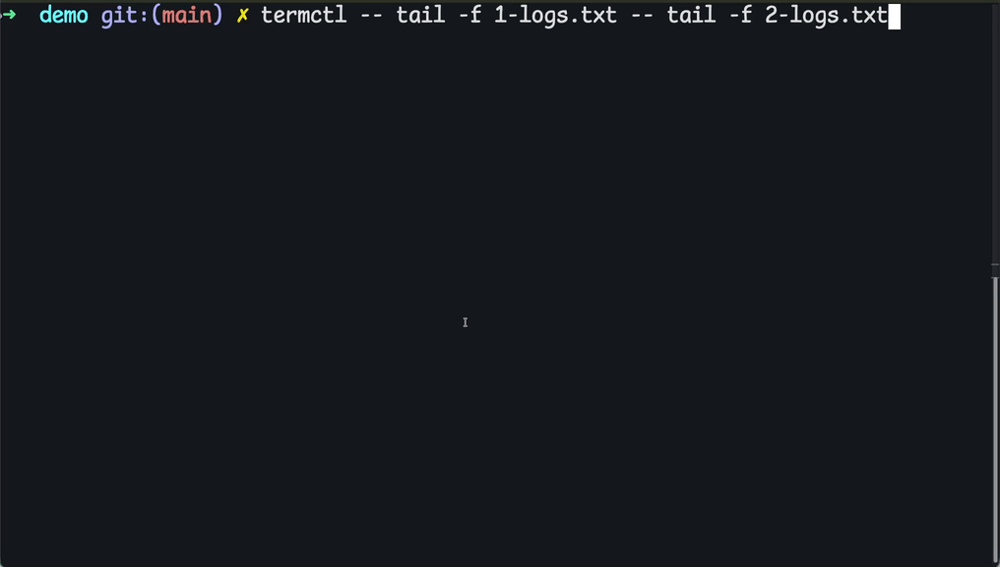

# termctl



Wrap iTerm2's Python API to split the current tab into N panes and run a command in each.

## Prerequisites

- macOS with [iTerm2](https://iterm2.com/) installed
- [`uv`](https://github.com/astral-sh/uv): `brew install uv`
- One-time iTerm2 setup:
  1. Open iTerm2 -> Settings -> General -> Magic
  2. Enable **"Enable Python API"**
  3. The first time you run `termctl`, iTerm2 will prompt you to approve the script. Approve it.

## Installation

The script uses [PEP 723](https://peps.python.org/pep-0723/) inline metadata, so `uv` resolves and caches the `iterm2` dependency on first run; nothing else to install.

### Recommended: symlink into `~/bin` (development-friendly)

A symlink keeps the installed command pointed at your working copy, so edits in the repo are picked up immediately without a reinstall step.

```bash
mkdir -p ~/bin
chmod +x /path/to/termctl/termctl
ln -s /path/to/termctl/termctl ~/bin/termctl
termctl --help
```

Make sure `~/bin` is on your `PATH` (zsh users typically add `export PATH="$HOME/bin:$PATH"` to `~/.zshrc`). If a fresh shell still can't find the command after creating `~/bin`, run `hash -r` or open a new terminal tab.

### Alternative: copy to a system bin directory

For a frozen snapshot (won't track edits in the repo):

```bash
chmod +x termctl
cp termctl /opt/homebrew/bin/termctl   # Apple Silicon
# or
sudo cp termctl /usr/local/bin/termctl # Intel Macs
```

### GUI launchers (Alfred, Raycast, Automator)

The shebang `#!/usr/bin/env -S uv run --script` needs `uv` on the launcher's `PATH`. If a GUI launcher fails with `env: uv: No such file or directory`, either hardcode the shebang to `#!/opt/homebrew/bin/uv run --script` for that install, or add `/opt/homebrew/bin` to the launcher's environment. Terminal use is unaffected.

## Usage

```bash
termctl exec [options] -- cmd1 -- cmd2 [-- cmd3 ...]
termctl       [options] -- cmd1 -- cmd2 [-- cmd3 ...]   # exec inferred
termctl exec [options] --file <path>
```

### Flags (for `exec`)

| Flag | Default | Description |
|---|---|---|
| `--split {horizontal,vertical}` | `vertical` | Pane orientation. `vertical` is side-by-side (default); `horizontal` stacks top-to-bottom. |
| `--delimiter <str>` | `--` | Separator between inline commands. |
| `--file <path>` | (none) | Read commands from a file, one per line. `-` reads from stdin. If the path is not found, falls back to `~/.termctl/presets/<basename>`. Can be combined with inline commands; file lines come first. |
| `--log-output <dest>` | `std` | Where termctl's own diagnostic output goes (NOT the panes' command output). See below. |
| `--dry-run` | off | Print the parsed plan and exit without touching iTerm2. |
| `--new-tab` | off | Open a new tab instead of splitting the current one. |
| `--debug` | off | Show Python tracebacks on errors. |
| `-h, --help` | | Usage info. |

### `--log-output` destinations

- `std` write diagnostics to stdout (default)
- `stderr` write diagnostics to stderr
- `""` empty string disables diagnostic output entirely
- any other value is treated as a **file path**, opened in append mode with line buffering

### Examples

Inline:
```bash
termctl exec -- stern -n prod api -- stern -n prod worker -- stern -n prod scheduler
```

Implicit `exec`:
```bash
termctl -- tail -f /var/log/a.log -- tail -f /var/log/b.log
```

Side-by-side (default):
```bash
termctl --split vertical -- top -- htop
```

Stacked top-to-bottom:
```bash
termctl --split horizontal -- tail -f /var/log/a.log -- tail -f /var/log/b.log
```

From a file (explicit path):
```bash
termctl exec --file ./examples/commands.txt
```

From a preset (resolves to `~/.termctl/presets/<name>`):
```bash
termctl exec --file my-preset
```
Drop preset files into `~/.termctl/presets/`. The directory is created automatically the first time termctl looks for a preset.

From stdin:
```bash
cat examples/commands.txt | termctl exec --file -
```

File and inline together (file lines first, then inline commands):
```bash
cat file-foo.txt | termctl --file - -- stern -n hello hello
```
If `file-foo.txt` contains `top` and `stern -n bye bye`, the above opens 3 panes in order: `top`, `stern -n bye bye`, `stern -n hello hello`.

Custom delimiter (so `--` can appear inside commands):
```bash
termctl exec --delimiter "@@" -- echo "a -- b" @@ echo c
```

Log to file:
```bash
termctl exec --log-output /tmp/termctl.log -- stern foo -- stern bar
```

Dry run:
```bash
termctl exec --dry-run -- stern foo -- stern bar
```

### File format

For `--file`:
- one command per line
- blank lines and lines starting with `#` are skipped
- shell quoting works: `tail -f "/var/log/my app.log"`
- lookup order: the path you pass first, then `~/.termctl/presets/<basename>` as fallback. The presets dir is auto-created on first lookup.

### Per-pane titles

Each pane's title is set to the command it runs, so you can tell `stern -n prod api` apart from `stern -n prod worker` at a glance instead of seeing identical "stern" labels.

## Exit codes

| Code | Meaning |
|---|---|
| `0` | Success |
| `2` | Usage error (bad flags, missing/conflicting commands, empty file) |
| `3` | iTerm2 connection issue (not running, no window, API not enabled) |
| `4` | Pane split or send-text failure |
| `5` | File read failure (`--file` path missing, unreadable, or log-output path unwritable) |

## Limitations

- `async_send_text` types into whatever the pane is currently doing. There is no shell-prompt awareness; if your shell is slow to start, the typed command may be lost. Run termctl on already-open shells.
- iTerm2 enforces a minimum pane size. Splitting more panes than the window can hold will fail with a pane-split error (exit 4).
- macOS + iTerm2 only. There is no fallback for Terminal.app, tmux, or other terminals.
- The default delimiter `--` collides with command flags. If a command needs a literal `--`, set a different separator with `--delimiter`.
- termctl logs only its own diagnostics. The panes' command output stays in the panes; capturing it requires a different approach (e.g. piping through `tee` inside each command).

## Troubleshooting

**`uv: command not found` from a GUI launcher.** GUI apps often don't see your shell's `PATH`. Either add `/opt/homebrew/bin` (Apple Silicon) or `/usr/local/bin` (Intel) to the launcher's environment, or invoke `termctl` from a terminal session.

**iTerm2 keeps prompting for permission, or the script never connects.** Reset script permissions in iTerm2 -> Settings -> General -> Magic, click "Edit Magic Settings", and re-approve. If the API isn't enabled there, enable it.

**Exit code 3 (`iTerm2 is not running or has no open window`).** Make sure iTerm2 is running with at least one window. If you're sure it is, verify the Python API is enabled.

**Exit code 4 (pane split failed).** The window is probably too small for that many panes; resize iTerm2 or reduce the number of commands.

**Exit code 5.** The `--file` path doesn't exist, isn't readable, or the `--log-output` file path can't be opened. Check permissions and that the path exists.

## Generate commands with an agent

`termctl prompt` provides two helpers for piping an LLM's output into `termctl`:

- `termctl prompt context` prints the agent prompt template. On first run it seeds `~/.termctl/prompt.md` from a built-in default, then prints the file. You can edit `prompt.md` to fit your workflow; rerun with `--regenerate` to restore the built-in default.
- `termctl prompt accept` reads agent output on stdin, strips markdown code fences, and saves the result to `~/.termctl/presets/llm_<D>:<M>:<Y>_<HH>:<MM>.txt` (local time, 24-hour). On a same-minute collision a short random suffix is appended. It then prints the cleaned content followed by the saved path and a copy-pasteable run command.
- `termctl prompt claude` builds the full `context | claude | accept` pipeline as a single shell line, copies it to your clipboard via `pbcopy`, and prints it to stdout. **It does not execute anything**; paste the line into your terminal to run it.

End-to-end recipe with [Claude Code](https://github.com/anthropics/claude-code):

```bash
termctl prompt context \
  | claude -p "watch CPU, memory, and disk activity" \
      --output-format text \
      --dangerously-skip-permissions \
  | termctl prompt accept
```

Or have termctl build that line for you:

```bash
termctl prompt claude "watch CPU, memory, and disk activity" -- --model sonnet
# prints the assembled pipeline and copies it to the clipboard;
# paste into your terminal to actually run it
```

Anything after `--` is appended verbatim to the embedded `claude` invocation, so `-- --model sonnet`, `-- --add-dir /path`, `-- --allowedTools "Bash(kubectl:*)"`, etc. all work.

The final pipe writes the cleaned commands to a preset file and prints the run line, e.g.:

```
saved to: /Users/you/.termctl/presets/llm_5:5:2026_14:00.txt
run with: cat /Users/you/.termctl/presets/llm_5:5:2026_14:00.txt | termctl --file -
```

`--dangerously-skip-permissions` is required because the pipeline is non-interactive: there is no TTY for the agent to ask permission on. If you want a tighter allowlist, replace it with `--allowedTools "Bash(kubectl:*) Bash(gh:*)"` (or whatever the task needs).

Once you're happy with the preset, run it. Either of these works:

```bash
cat ~/.termctl/presets/llm_5:5:2026_14:00.txt | termctl --file -
termctl --file llm_5:5:2026_14:00.txt   # resolves via the presets fallback
```

The agent only sees the file `~/.termctl/prompt.md`; nothing else about termctl leaks. Customize that file to add environment-specific context (cluster names, namespaces, common commands).

## License

MIT. See [LICENSE](LICENSE).
